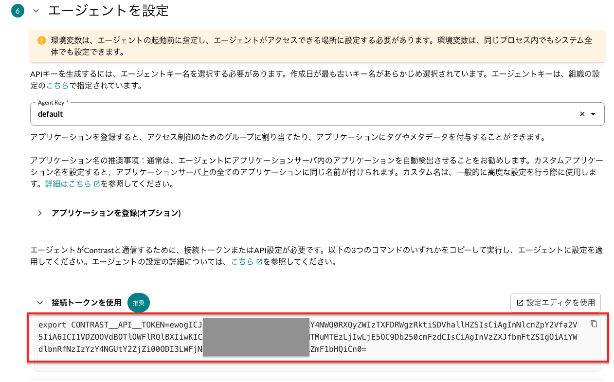

# FlexAgentの話

## フレックスエージェントのインストール
手動インストールについてのドキュメントページは[こちら](https://docs.contrastsecurity.jp/ja/flex-agent-workflow-manual.html)
```bash
# ダウンロード
curl -L --output /tmp/contrast-flex-agent.tar.gz https://contrastsecurity.jfrog.io/artifactory/flex-agent-release/latest/contrast-flex-agent.tar.gz
# 展開
mkdir -p /tmp/contrast-flex-agent
tar -xpzf /tmp/contrast-flex-agent.tar.gz -C /tmp/contrast-flex-agent
# インストール
/tmp/contrast-flex-agent/install.sh --api-token $AGENT_TOKEN
```
$AGENT_TOKENに関しては、TeamServerの新規登録ウイザードの**多言語インストール**の手順で確認することができます。  
EOP版TeamServerをお使いで、新規登録ウイザードに**多言語インストール**の項目が表示されていない場合は  
下のスクリーンショットのように**Javaエージェント**の手順のところでも確認することができます。  


## フレックスエージェントのアンインストール
```bash
# バージョンを確認
contrast-flex --version
# アンインストール(versionは上記コマンドで確認してください)
/usr/bin/contrast-flex-agent/service/${version}/uninstall.sh
```

## 各種コマンド
```bash
# インジェクト状態
contrast-flex app

# インジェクトされる各言語ごとエージェントバージョン
contrast-flex agents list

# Javaエージェントのアップデート
contrast-flex agents update java

# アートアタッチの停止
contrast-flex auto-attach set false
```
